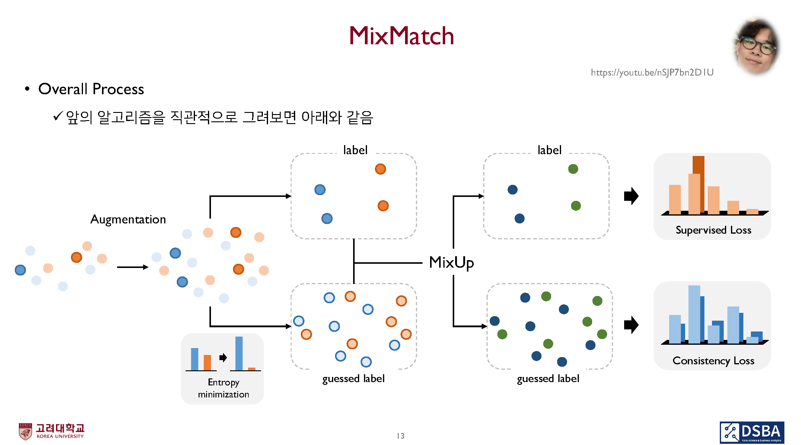
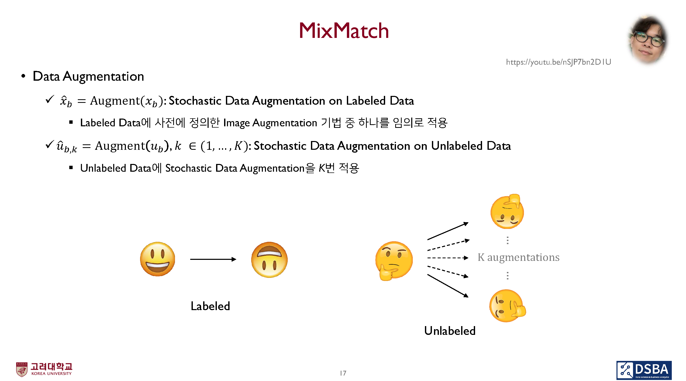
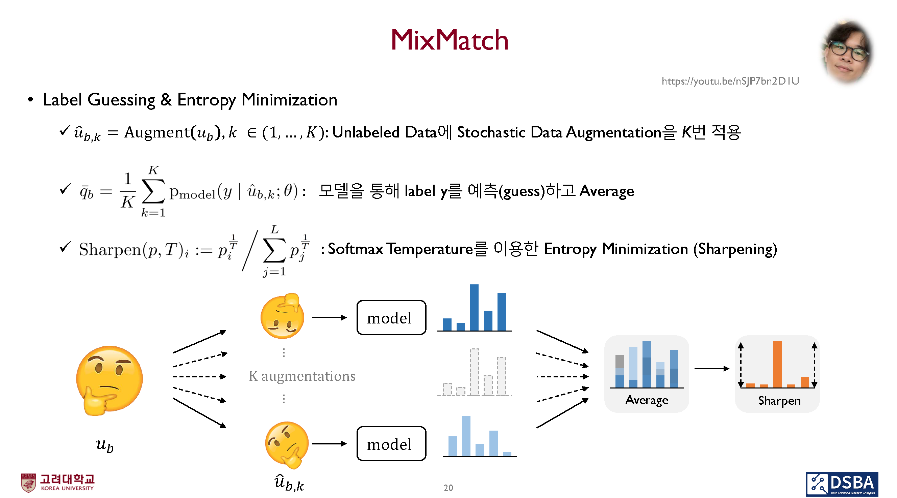
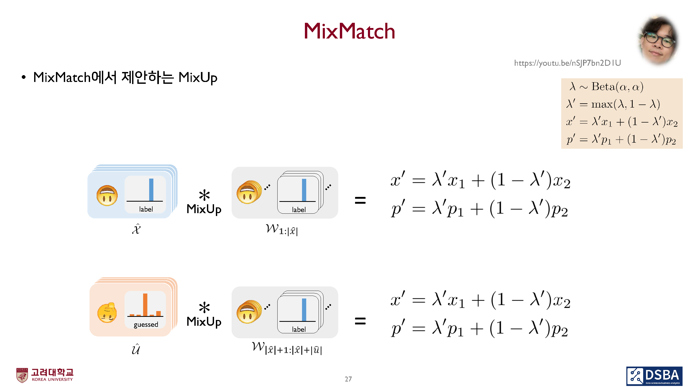

# Semi-Supervised Learning: MixMatch

## 📝 Table of Contents

- [About](#about)
- [MixMatch(Berthelot, 2019)](#MixMatch)
- [Directory](#directory)
- [Arguments](#arguments)
- [How to run](#running)
- [Examples](#examples)
- [References](#references)

## 🧐 About <a name = "about"></a>

Here, you can try MixMatch, which is one of the semi-supervised learning methodologies, with the CIFAR10 dataset and WideResNet model.


## 🧐 MixMatch(Berthelot, 2019) <a name = "MixMatch"></a>
<center>Overall Procedure</center>  



In simple, it can be explained by following  steps:  

1) Data Augmentation  

      
    <center>
    Data Augmentation
    </center> 
    
    Get the average of outputs of several augmented unlabeled data.  

2) Label Guessing and Sharpening  

    
    <center>Label Guessing and sharpening</center>  

    Apply softmax with temperature for minimizing the entropy(or sharpening the highest value) and get the guessed label.

3) Mix Up  

    
    <center>Mix Up</center>

    Mix Up is applied to unlabeled data only in general, however, it can be applied to labeled data as well here.  

4) Loss  

    Total loss is the sum up of Supervised loss and Consistency loss    
    $L=L_l$(Cross Entropy)$+\lambda L_u$(L2 loss)


## 🧐 Directory <a name = "directory"></a>

Directory of this folder.

```
|-- README.md
|-- datasets
|   |-- __init__.py
|   |-- __pycache__
|   |-- build_dataset.py
|   |-- cifar10.py
|   `-- data_utils.py
|-- figures
|   |-- DataAugmentation.png
|   |-- LabelGuessing.png
|   |-- MixMatch.png
|   `-- MixUp.png
|-- logger.py
|-- main.py
|-- models
|   |-- ResNet.py
|   |-- WideResNet.py
|   |-- __init__.py
|   |-- __pycache__
|   `-- model_utils.py
|-- parser.py
|-- scripts
|   `-- run.sh
|-- temp.ipynb
|-- train.py
|-- train_utils.py
|-- utils.py  

```

## 🧐 Arguments <a name = "arguments"></a>

Here are descriptions of each argument for running the experiment. You can check the default argumnets in  *parser.py*.  

|Name|Description|
|:--:|:--:|
|experiment_dir|Name of a folder for saving the results|
|seed|Seed Number for any components with randomness (default: 42)|
|device|Index of GPU Device that will be used (default: 0)|
|n_labeled|Number of labeled data in Trainset. (default: 500)|
|n_valid|Number of data which is all labeled in Validset (default: 100)|
|alpha|Weight for Mix UP (default: 0.75)|
|lambda_u|Weight for Consistency loss (default: 0.75)|
|T|Temperature of Softmax for sharpening (default: 0.5)|
|ema_decay|Weight for EMA(Expected Moving Average) (default: 0.999)|
|epochs|Number of epochs (default: 10)|
|batch_size| Size of each batch (default: 8)|
|lr|Learning rate for the optimizers (default: 1e-3)|

## 🧐 How to run <a name = "running"></a>

Once you finish typing the arguments you need in 'scripts/run.sh', then running it as follows. You must set your current directory as '05_Semi_Supervised_Learning'

    ```bash
    bash scripts/run.sh
    ```


## 🧐 Examples <a name = "examples"></a>

Let's conduct an experiment for comparing effect of number of labeled data in the trainset. Basically, when you use CIFAR10 dataset from torchvision, there 50,000 training data(5,000 per class) and 10,000(1,000 per class) test data. 

We are going to use only few of labeled data [250, 500, 750] with differente models [*WideResNet*, *ResNet34*].  

Basic experiment setting:  

|Name|Description|
|:--:|:--:|
|Transformation on Training data|RandomPadandCrop(32),RandomFlip|
|Number of augmentation|2 times|
|Optimizer|Adam|
|Epochs|10|
|Learning rate|1e-3|


Here is the result using the testset

|    Model   | Number of Labeled data | Top1 Acc | Top5 ACC |
|:----------:|:----------------------:|:--------:|:--------:|
|            |           250          |   29.16  |   80.03  |
|   ResNet   |           500          |   33.14  |   85.28  |
|            |           750          |   40.43  |   89.74  |
|            |           250          |   38.17  |   87.18  |
| WideResNet |           500          |   57.71  |   93.95  |
|            |           700          |   61.59  |   95.69  |


You can change any other compononts such as the combination of transformations, number of augmentations etc. Try yourself!

## 🧐 References <a name = "references"></a>

* Business Analytics(2022 Fall, IME 654) Materials  
* [MixMatch: A Holistic Approach to Semi-Supervised Learning(Berthelot et al., 2019)](https://arxiv.org/abs/1905.02249)  

